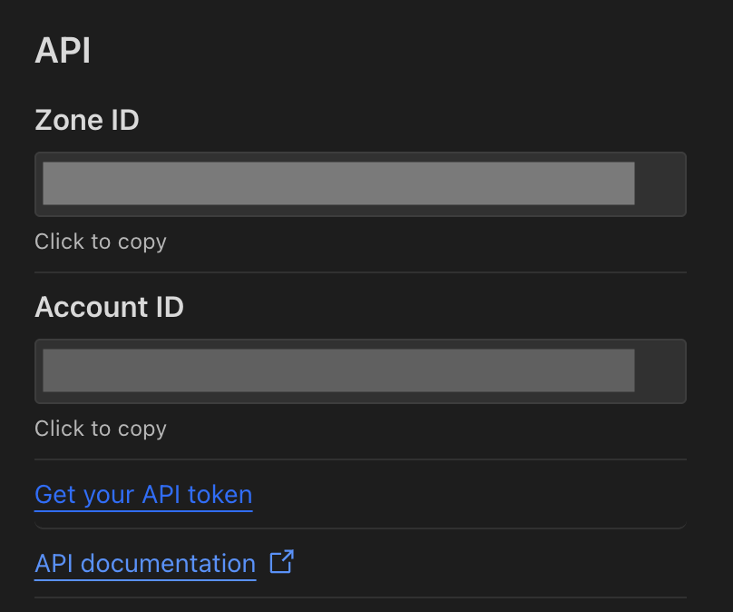

# Cloudflare Tunnel Ingress Controller

Cloudflare Tunnels allow you to proxy traffic into your network from Cloudflare's edge network.
This enables you to route traffic to your services without exposing them to the public internet.

This document helps you set up the `cloudflare-tunnel-ingress-controller`, which will create a Cloudflare Tunnel
and corresponding DNS entries based on your Kubernetes configuration. You will be able to simply specify an
`ingress.yaml` and traffic will be routed to your services as per your specifications.

## Installation

You have to set up the controller via Helm. First add the Helm repository:

```bash
helm repo add strrl.dev https://helm.strrl.dev
helm repo update
```

Next, you have to retrieve an API token and your account id from your Cloudflare Account. For that, you have to go
to your account overview:



Then you have to click on the "API Tokens" tab and create a new token with the following permissions:

- Zone:Zone:Read
- Zone:DNS:Edit
- Account:Cloudflare Tunnel:Edit

Next, copy your API Token and Account ID and install the Controller Helm chart:

```bash
helm upgrade --install --wait \
  -n cloudflare-tunnel-ingress-controller --create-namespace \
  cloudflare-tunnel-ingress-controller \
  strrl.dev/cloudflare-tunnel-ingress-controller \
  --set=cloudflare.apiToken="<cloudflare-api-token>",cloudflare.accountId="<cloudflare-account-id>",cloudflare.tunnelName="<your-tunnel-name>" 
```

Note that the Tunnel will be created if it does not already exist.

## Usage